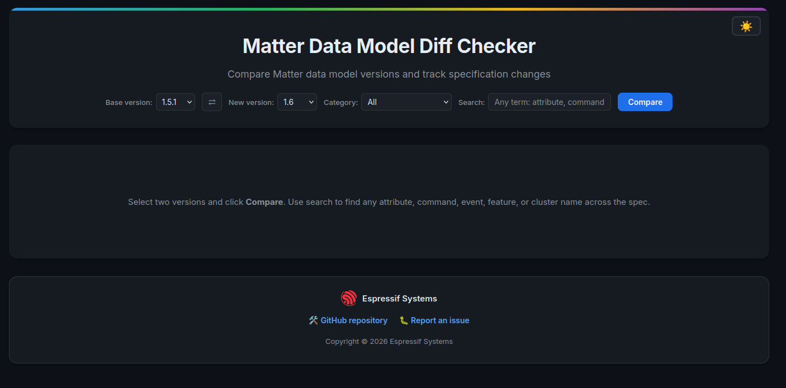
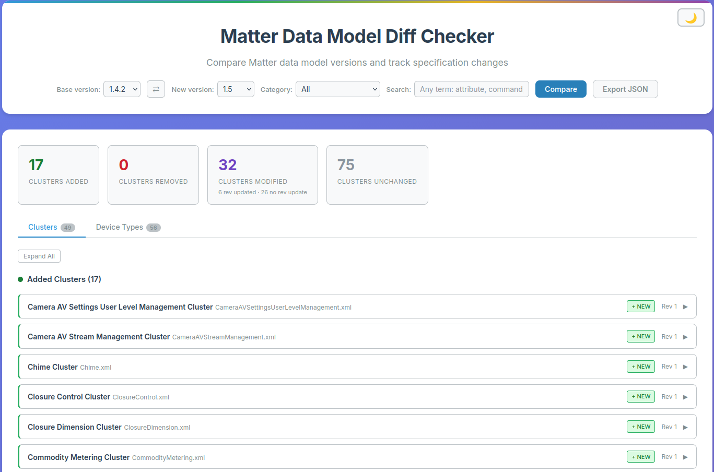

# Matter Data Model Diff Checker

A browser-based diff tool for comparing [Matter](https://csa-iot.org/all-solutions/matter/) specification data models across versions. It parses the official XML cluster and device-type definitions and produces a structured, searchable diff.

## What It Does

This tool lets you pick any two Matter spec versions and instantly see what changed:

- **Added / Removed / Modified clusters** — with full detail down to individual attributes, commands, events, features, data types, and their fields.
- **Added / Removed / Modified device types** — including cluster requirements, condition requirements, features, and commands.
- **Revision tracking** — highlights clusters or device types whose content changed but whose revision number was _not_ bumped ("No Revision Update" warnings).
- **Deep search** — type any term (an attribute name, a command, an event, a feature flag, an enum value) and the tool filters the diff to show only matching elements, even inside nested structures.
- **Export** — download the computed diff as a JSON file for offline analysis or integration with other tooling.

## Screenshots

| Dark Mode                             | Light Mode                                   |
| ------------------------------------- | -------------------------------------------- |
|  |  |

## Running Locally

`build_tool.sh` builds the local data files (see [below](#adding-or-updating-a-matter-version)) and, with `--serve`, starts a static HTTP server:

```bash
cd dm_diff_tool

./build_tool.sh --serve          # add --port 9000 to change the port
```

Then open `http://localhost:8000` in your browser.

If you already have the data files built and just want to serve the directory, any static HTTP server works (e.g. `python3 -m http.server 8000`).

> **First-load note:** The tool downloads the Pyodide Python runtime (~20 MB) on the first visit. A loading spinner is shown during this time. Subsequent loads are faster once the browser has cached the runtime.

## Adding or Updating a Matter Version

Neither the raw XML files nor the built zips are committed — the deploy CI builds everything from [connectedhomeip](https://github.com/project-chip/connectedhomeip) on every push to `main`.

To build locally for development:

```bash
# Auto-clones connectedhomeip (data_model/ only) into /tmp, then builds zips:
./build_tool.sh

# Or, if you already have a local connectedhomeip checkout:
MATTER_SDK_PATH=/path/to/connectedhomeip
./build_tool.sh

# Add --serve to build and then open a local server in one step:
./build_tool.sh --serve
```

This reads `$MATTER_SDK_PATH/data_model/{version}/clusters/` and `$MATTER_SDK_PATH/data_model/{version}/device_types/`, produces one zip per version under `data_model/zips/`, and regenerates `data_manifest.json`.
